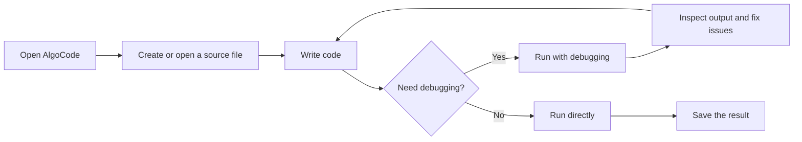

# AlgoCode Documentation

AlgoCode is a lightweight code editor for algorithm practice and everyday development. It focuses on fast startup, a clear editing experience, and a short write-run-feedback loop.

## Product focus

AlgoCode is designed for:

- Writing and debugging C++ algorithm exercises
- Reviewing small projects or individual source files
- Running code in classrooms and practice environments
- Developers who prefer a focused, low-overhead editor

## The basic workflow



## Your first program

Create `main.cpp` and enter the following code:

```cpp
#include <iostream>

int main() {
  std::cout << "Hello, AlgoCode!\n";
  return 0;
}
```

After clicking the run button, the output panel should show:

```text
Hello, AlgoCode!
```

## Scripting the workflow

Future versions may provide a scripting interface. The following example illustrates the intended TypeScript shape:

```typescript
import { openWorkspace, runTask } from 'algocode';

const workspace = await openWorkspace('./practice');
await runTask(workspace, 'main.cpp');
```

## Frequently asked questions

### Which languages does AlgoCode support?

The sample release focuses on C++ and leaves room for Python, Rust and other language integrations. The supported language list will be updated with each release.

### Is my code uploaded to a server?

The default workflow is designed around local processing. When a feature uses classroom or collaboration services, its data flow will be documented separately.

### What is planned next?

Planned directions include a more complete debugger, project templates, code snippets, and classroom integration with AlgoClass.
