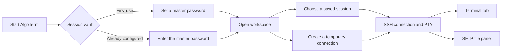

# AlgoTerm Documentation

AlgoTerm is a desktop SSH terminal client for development and operations work. It is written in Rust, uses GPUI for the desktop interface, uses `alacritty_terminal` for terminal state and ANSI rendering, and connects to remote servers through `russh`.

Its main idea is to keep the remote terminal, connection profiles and common file operations in one focused dark workspace: open the app, unlock the session vault, connect to a server, and work from terminal tabs or the SFTP panel.

## Current capabilities

- **Terminal emulation**: ANSI/VT state handling, 256 colors, cursor rendering, scrolling, mouse selection, search, copy and paste.
- **SSH sessions**: Password authentication, PTY and remote shells, with terminal resize forwarded to the server.
- **Host-key verification**: Shows the fingerprint on first connection and stores accepted keys in OpenSSH `known_hosts` format.
- **Session workspace**: Groups, creates, edits and deletes sessions; optionally remembers passwords; supports multiple terminal tabs.
- **Temporary connections**: Connect once without saving session credentials or temporary host trust decisions.
- **SFTP file panel**: Browse directories, create/delete/rename entries, upload and download files or directories, and track transfer progress.
- **Appearance**: Built-in Augur Dark+ and Catppuccin themes, user themes, UI and terminal fonts, font sizes and fallback fonts.
- **Localization**: English and Simplified Chinese user interfaces.



## Quick start

### Build from source

The project uses Cargo for Rust dependencies. Some GUI dependencies are pulled from Git repositories, so the first build needs Git and network access.

```bash
cargo build
cargo test
cargo run
```

`cargo run` starts the desktop application. `cargo test` covers non-GUI logic such as the vault, application paths and session completion handling.

### Connect to an SSH server

1. Set a master password on first launch. It unlocks the local session vault and is not written to the database.
2. Create a session in the left sidebar with a name, host, port and username.
3. Double-click the session. If no password is stored, AlgoTerm asks for it before connecting.
4. On the first connection to a host, compare and confirm the displayed SHA-256 host fingerprint.
5. After the connection is ready, use the terminal tab for shell work. The SFTP panel becomes available when the server provides the SFTP subsystem.

The quick-connect bar can also be used for a one-time connection. Temporary connections are not added to the session list and do not save new host trust decisions.

### Run the local test SSH server

The repository includes an echo server for development validation. It accepts any username and password and listens on `127.0.0.1:2222` by default:

```bash
ssh-keygen -t ed25519 -f test_ssh_key -N ""
cargo run --bin ssh_test_server -- test_ssh_key 2222
```

Connect from AlgoTerm with:

```text
Host: 127.0.0.1
Port: 2222
Username: test
Password: any value
```

If the port is in use, pass another port as the final argument, such as `2223`.

## Common operations

| Operation                   | Shortcut or action                                         |
| --------------------------- | ---------------------------------------------------------- |
| Search terminal content     | `Ctrl+F`                                                   |
| Copy selection              | `Ctrl+Shift+C`                                             |
| Paste                       | `Ctrl+Shift+V`                                             |
| Select all terminal content | `Ctrl+Shift+A`                                             |
| Resize the terminal         | Resize the window or layout; the PTY follows automatically |
| Connect a saved session     | Double-click it in the sidebar                             |
| Manage a session            | Use the session context menu or the add button             |

Closing a tab that is still connected prompts for confirmation before disconnecting the remote shell.

## Sessions and data security

Persistent data is stored in the platform-standard application directories under `augur-term`:

| Data                 | File or directory                                     | Purpose                                     |
| -------------------- | ----------------------------------------------------- | ------------------------------------------- |
| Application settings | `augur-term/config.json` in the config directory      | Language, theme, fonts and sizes            |
| Session database     | `augur-term/profile.redb` in the local data directory | Session records and vault verification data |
| Host trust           | `augur-term/known_hosts` in the local data directory  | Accepted SSH host keys                      |
| User themes          | `augur-term/themes/*.json` in the config directory    | Zed theme family files                      |

When a password is saved, the application:

1. Derives a 32-byte key from the master password and a random salt with PBKDF2-HMAC-SHA256, currently using 600,000 iterations.
2. Encrypts each session password separately with AES-256-GCM and a random nonce.
3. Stores only derivation parameters, authentication ciphertext and session ciphertext in the database; the master password and unlocked key remain in memory.

This is application-level protection, not a replacement for operating-system permissions, disk encryption or a strong master password. Protect the application data directory on shared machines.

## Themes, fonts and configuration

AlgoTerm includes Augur Dark+, Catppuccin Latte, Frappé, Macchiato and Mocha. Put user themes in:

```text
<config-dir>/augur-term/themes/*.json
```

Themes use the Zed theme family format. Terminal colors can be customized with `terminal.background`, `terminal.foreground` and `terminal.ansi.*`. The `docs/THEMES.md` file in the augur-term repository documents the complete fields and fallback behavior.

Terminal fallback fonts are tried in order, which is useful for CJK and other glyphs missing from the primary font. The default configuration uses JetBrains Mono with Source Han Sans SC as a fallback.

## Project structure

```text
src/
├── main.rs                 # Application entry point, assets and logging
├── workspace.rs            # Main window, sidebar, tabs and dialogs
├── core/
│   ├── ssh.rs              # SSH/SFTP connection and worker event loop
│   ├── vault.rs            # Master-key derivation and AES-GCM encryption
│   ├── profile.rs          # redb session database
│   ├── session.rs          # Session model and connection targets
│   ├── config.rs           # Application settings
│   └── paths.rs            # Cross-platform data paths
└── terminal/
    ├── mod.rs              # Terminal state, rendering, input, search and clipboard
    └── palette.rs           # ANSI palette
```

SSH work runs on a dedicated Tokio runtime thread. Remote data travels through an event channel into GPUI, and the terminal component passes it to `alacritty_terminal` for parsing. SFTP opens a separate authenticated channel, so file operations do not block terminal data.

## Development checks

Useful checks include:

```bash
cargo fmt --all
cargo test
cargo check --all-targets
```

The GUI, real SSH servers, host-key confirmation and SFTP transfers should still be checked manually on the target platforms. Development logs are written to `debug.log` in the project root and must not contain master or session passwords.

## Frequently asked questions

### Which authentication methods are supported?

The current session model and connection form implement SSH password authentication. Key-based authentication and other methods are future extension points, not current features.

### Does a temporary connection save its password?

No. Temporary connection information exists only for the lifetime of its tab. New host keys accepted by a temporary connection are also not written to the persistent `known_hosts` file.

### Why is the SFTP panel unavailable after connecting?

The remote server must provide and allow the `sftp` subsystem. A server that exposes only an interactive shell can still be used in the terminal, but the file panel cannot initialize.

### Can I copy `profile.redb` to another computer?

Direct copying is not recommended. Session passwords are protected by a key derived from the master password, and migrations should account for the target environment, application version and backups. Always keep the original file backed up.
