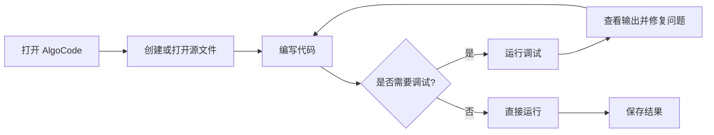

# AlgoCode 使用文档

AlgoCode 是一款面向算法练习和日常开发的轻量代码编辑器。它强调快速启动、清晰的编辑体验，以及“写完即跑”的反馈循环。

## 产品定位

AlgoCode 适合以下场景：

- 编写和调试 C++ 算法题
- 快速查看小型项目或单个源文件
- 在课堂或练习环境中运行代码
- 需要低干扰、低资源占用的编辑器体验

## 基础使用流程



## 第一个程序

创建 `main.cpp`，输入下面的代码：

```cpp
#include <iostream>

int main() {
  std::cout << "Hello, AlgoCode!\n";
  return 0;
}
```

点击运行按钮后，输出面板应该显示：

```text
Hello, AlgoCode!
```

## 使用脚本扩展工作流

未来版本会提供脚本化接口。下面的示例展示一种预期的 TypeScript 调用方式：

```typescript
import { openWorkspace, runTask } from 'algocode';

const workspace = await openWorkspace('./practice');
await runTask(workspace, 'main.cpp');
```

## 常见问题

### AlgoCode 支持哪些语言？

示例版本优先支持 C++，并预留 Python、Rust 等语言的扩展空间。具体支持范围会随版本发布说明更新。

### 代码会上传到服务器吗？

默认工作流以本地处理为主。涉及在线课堂或协作功能时，具体数据范围会在对应功能的说明中单独标注。

### 后续会增加什么功能？

计划中的方向包括更完整的调试器、项目模板、代码片段管理，以及与 AlgoClass 的课堂联动。
