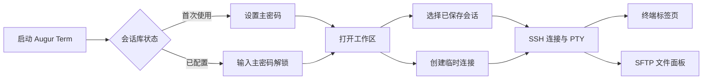

# Augur Term 使用文档

Augur Term 是一款面向开发者和运维场景的桌面 SSH 终端客户端。它使用 Rust 编写，以 GPUI 构建桌面界面，以 `alacritty_terminal` 负责终端状态和 ANSI 渲染，并通过 `russh` 与远程服务器建立 SSH 连接。

它的核心目标是把远程终端、连接配置和常用文件操作放在一个轻量的深色工作区中：打开应用、解锁会话库、连接服务器，然后在标签页中完成终端操作或 SFTP 文件传输。

## 当前能力

- **终端模拟**：ANSI/VT 状态解析、256 色、光标、滚动、鼠标选区、搜索、复制和粘贴。
- **SSH 会话**：密码认证、PTY 和远程 Shell，窗口大小变化会同步到远程端。
- **主机密钥验证**：首次连接时显示指纹，确认后按 OpenSSH `known_hosts` 格式保存。
- **会话工作区**：会话分组、创建、编辑、删除、记住密码，多标签并行连接。
- **临时连接**：只连接一次，不保存会话凭据或临时主机信任记录。
- **SFTP 文件面板**：浏览目录，新建、删除和重命名条目，上传/下载文件及目录，并显示传输进度。
- **外观设置**：内置 Augur Dark+ 和 Catppuccin 系列主题，支持用户主题、界面字体、终端字体、字号和字体回退。
- **本地化**：界面提供 English 和简体中文。



## 快速开始

### 从源码构建

项目使用 Cargo 管理 Rust 依赖。由于部分图形界面依赖来自 Git 仓库，首次构建需要可用的 Git 和网络环境。

```bash
cargo build
cargo test
cargo run
```

`cargo run` 启动桌面应用；`cargo test` 覆盖密钥库、路径、会话完成状态等不依赖图形界面的逻辑。

### 连接 SSH 服务器

1. 首次启动时设置主密码。主密码用于解锁本地会话库，不会写入数据库。
2. 在左侧会话区域创建会话，填写名称、主机、端口和用户名。
3. 双击会话连接；如果没有保存密码，应用会在连接前询问密码。
4. 第一次连接某台主机时核对并确认 SHA-256 主机指纹。
5. 连接成功后，可以在终端标签页中输入命令；右侧 SFTP 面板会在服务器提供 SFTP 子系统时可用。

也可以使用顶部的快速连接栏进行一次性连接。临时连接关闭后不会加入会话列表，也不会保存新的主机信任记录。

### 使用本地测试 SSH 服务器

仓库包含一个仅用于开发验证的回显服务器。它接受任意用户名和密码，并默认监听 `127.0.0.1:2222`：

```bash
ssh-keygen -t ed25519 -f test_ssh_key -N ""
cargo run --bin ssh_test_server -- test_ssh_key 2222
```

然后在 Augur Term 中连接：

```text
主机：127.0.0.1
端口：2222
用户名：test
密码：任意值
```

如果端口已被占用，可以把最后一个参数改成其他端口，例如 `2223`。

## 常用操作

| 操作           | 快捷键或方式                             |
| -------------- | ---------------------------------------- |
| 搜索终端内容   | `Ctrl+F`                                 |
| 复制选区       | `Ctrl+Shift+C`                           |
| 粘贴           | `Ctrl+Shift+V`                           |
| 全选终端内容   | `Ctrl+Shift+A`                           |
| 调整终端大小   | 拖动窗口或改变布局，PTY 会自动同步       |
| 连接保存的会话 | 双击左侧会话                             |
| 管理会话       | 会话项右键菜单，或使用会话区域的新增按钮 |

关闭仍处于连接状态的标签页时，应用会先要求确认，以避免意外断开远程 Shell。

## 会话和数据安全

会话资料保存在平台标准的应用目录下，目录名为 `augur-term`：

| 数据       | 文件或目录                                 | 说明                     |
| ---------- | ------------------------------------------ | ------------------------ |
| 应用配置   | 配置目录下的 `augur-term/config.json`      | 语言、主题、字体和字号   |
| 会话数据库 | 本地数据目录下的 `augur-term/profile.redb` | 会话记录和密钥库验证数据 |
| 主机信任   | 本地数据目录下的 `augur-term/known_hosts`  | 已确认的 SSH 主机密钥    |
| 用户主题   | 配置目录下的 `augur-term/themes/*.json`    | Zed 主题族格式           |

保存密码时，应用使用以下流程：

1. 使用 PBKDF2-HMAC-SHA256 从主密码和随机盐派生 32 字节密钥，当前迭代次数为 600,000。
2. 使用 AES-256-GCM 为每个会话密码单独加密，并生成随机 nonce。
3. 数据库只保存派生参数、认证密文和会话密文；主密码和解锁后的密钥只在内存中存在。

这是一层应用级保护，不能替代操作系统账户、磁盘加密或安全的主密码。共享电脑上仍应使用操作系统权限保护应用数据目录。

## 主题、字体和配置

应用自带 Augur Dark+、Catppuccin Latte、Frappé、Macchiato 和 Mocha。用户主题放入以下目录即可被加载：

```text
<config-dir>/augur-term/themes/*.json
```

主题使用 Zed theme family 格式，终端颜色可以通过 `terminal.background`、`terminal.foreground` 和 `terminal.ansi.*` 配置。完整字段和字体回退规则见 augur-term 仓库中的 `docs/THEMES.md`。

终端字体回退按配置顺序尝试，主要用于 CJK 等主字体缺失的字符。默认配置使用 JetBrains Mono，并包含 Source Han Sans SC 回退字体。

## 项目结构

```text
src/
├── main.rs                 # 应用入口、资源和日志初始化
├── workspace.rs            # 主窗口、会话侧栏、标签页和弹窗
├── core/
│   ├── ssh.rs              # SSH/SFTP 连接和后台事件循环
│   ├── vault.rs            # 主密码派生和 AES-GCM 加密
│   ├── profile.rs          # redb 会话数据库
│   ├── session.rs          # 会话模型和连接目标
│   ├── config.rs           # 应用配置
│   └── paths.rs            # 跨平台数据路径
└── terminal/
    ├── mod.rs              # 终端状态、渲染、输入、搜索和剪贴板
    └── palette.rs           # ANSI 调色板
```

SSH 网络任务运行在独立 Tokio runtime 线程中。远程数据通过事件通道送入 GPUI，终端组件再交给 `alacritty_terminal` 解析；SFTP 使用同一 SSH 认证建立独立子通道，因此文件操作不会阻塞终端数据流。

## 开发验证

常用检查命令：

```bash
cargo fmt --all
cargo test
cargo check --all-targets
```

图形界面、真实 SSH 服务器、主机指纹确认和 SFTP 传输仍应在目标平台上手动验证。开发日志默认写入项目根目录的 `debug.log`，不会包含主密码或会话密码。

## 常见问题

### Augur Term 支持哪些认证方式？

当前会话模型和连接表单实现的是 SSH 密码认证。密钥认证等方式需要后续扩展，不应将当前版本描述为已经支持。

### 临时连接会保存密码吗？

不会。临时连接只在当前标签页生命周期内使用连接信息，关闭后丢弃；临时连接发现的新主机密钥也不会写入持久化的 `known_hosts`。

### 为什么连接成功但看不到 SFTP？

SFTP 面板需要远程服务器提供并允许 `sftp` 子系统。服务器只提供交互式 Shell 时，终端仍可正常使用，但文件面板无法初始化。

### 可以把 `profile.redb` 复制到另一台电脑吗？

不建议直接复制后使用。会话密码由主密码派生的密钥保护，迁移前应先确认目标环境、应用版本和数据备份策略，并始终保留原文件备份。
